# SQL Copilot

SQL Copilot 是一个 AI 原生数据库工作台。

它不是把一个聊天框贴到数据库工具里，而是把连接管理、Schema 感知、SQL 生成、执行验证、Explain 分析、图表洞察、ER 理解、样例 SQL 和记忆沉淀，串成一条真正可落地的数据库工作流。

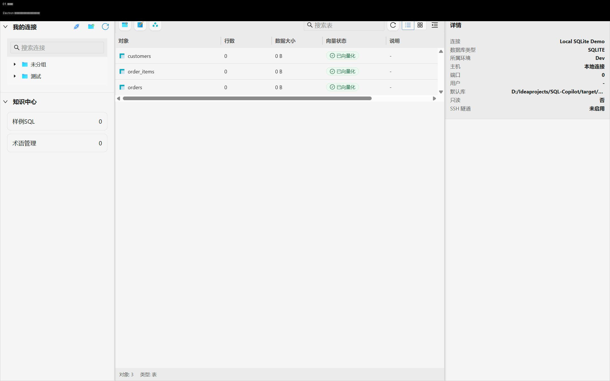

## 为什么它比“普通 AI 助手写 SQL”更省心

- 精准拿到元数据：连接数据库后，AI 可以结合真实的表、字段、视图、函数和对象说明组织上下文，不用你反复复制 DDL。
- 不用来回复制报错：SQL 执行结果、Explain、分析结论和图表结果都在同一工作台里，修复时可以直接基于现场反馈继续追问。
- 不是只吐一段 SQL：从自然语言到 SQL，再到执行、分析、图表、导出，整个闭环都能在一个界面里完成。
- 越用越懂业务：样例 SQL、术语、历史会话和 Schema 可以沉淀为长期上下文，减少每次重新解释业务背景的成本。

## 界面预览

### 1. 启动后就是完整的数据库工作台

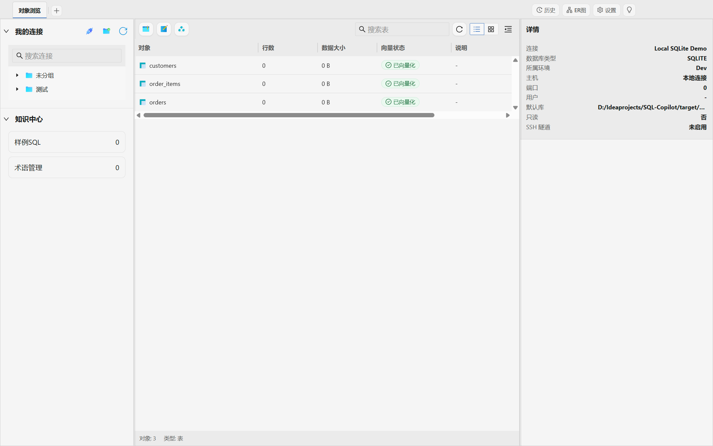

左侧是连接与知识中心，中间是对象列表，右侧是详情面板。SQL Copilot 从一开始就是“数据库工作台”，不是只有一个问答窗口。

### 2. 选中对象后，元数据和建表语句直接可见

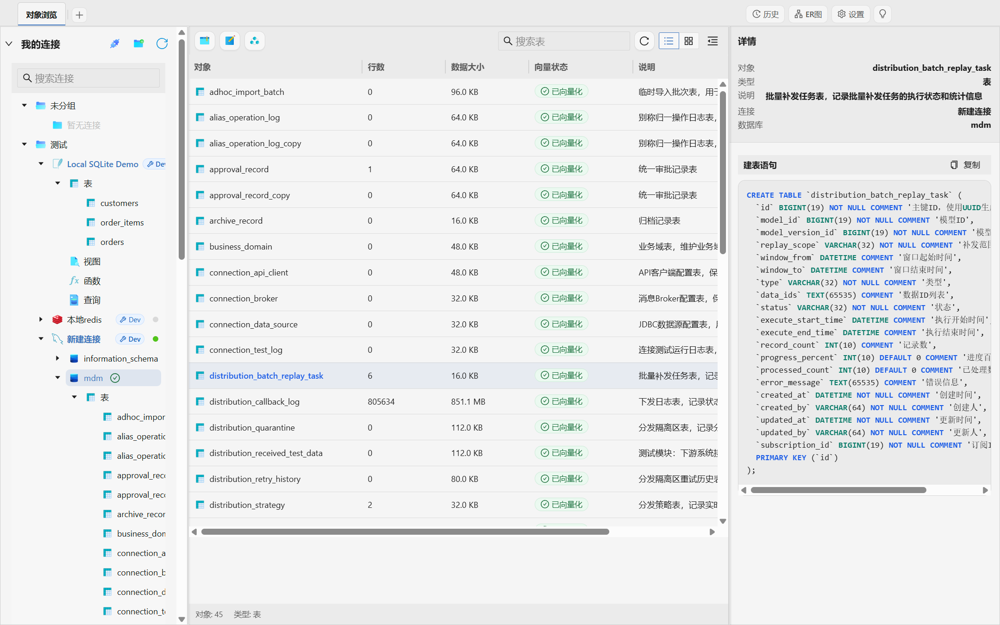

表行数、数据大小、说明和建表语句都能直接查看。AI 生成 SQL 时拿到的是当前连接里的真实上下文，而不是你临时粘贴的一段表结构。

### 3. 自然语言生成 SQL，可以立即落到可执行结果

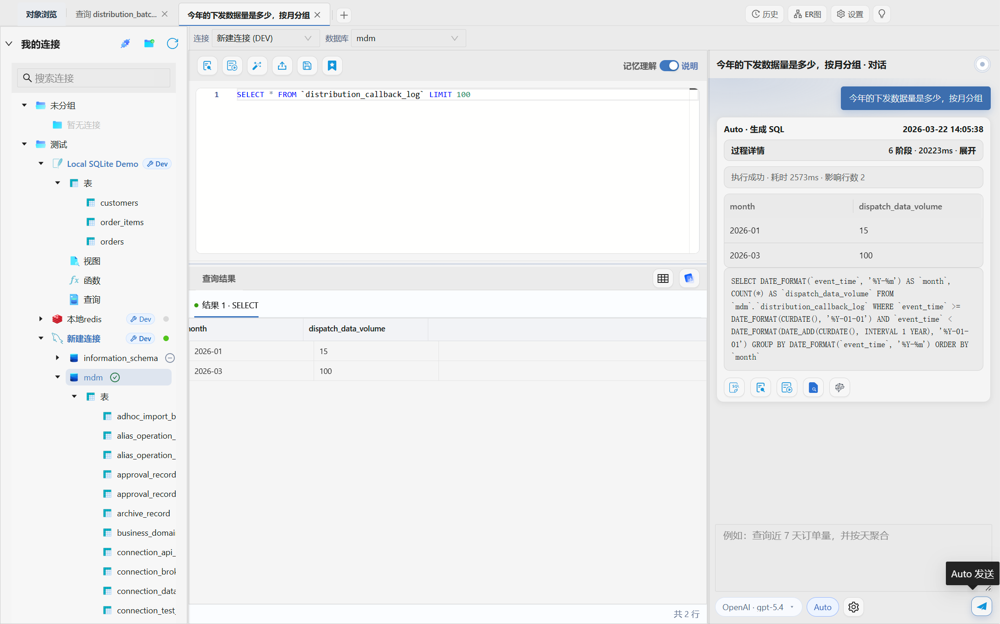

输入业务问题后，SQL 会直接回填到编辑器，结果表格也在同屏展示，方便立刻验证是不是你真正想要的查询。

### 4. 查询结果可以继续生成图表

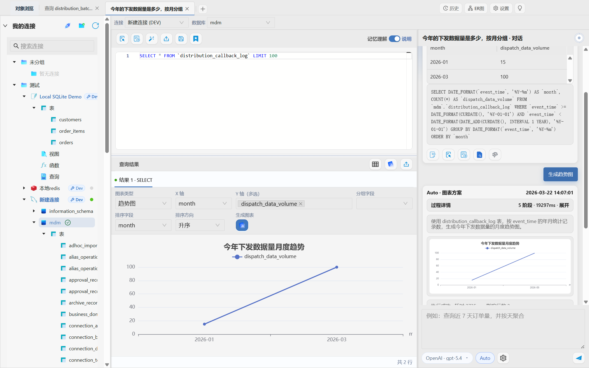

SQL 生成不是终点，同一份结果集可以继续转成趋势图、柱状图等分析视图，适合做日报、周报和临时洞察。

### 5. SQL 还能继续解释和分析

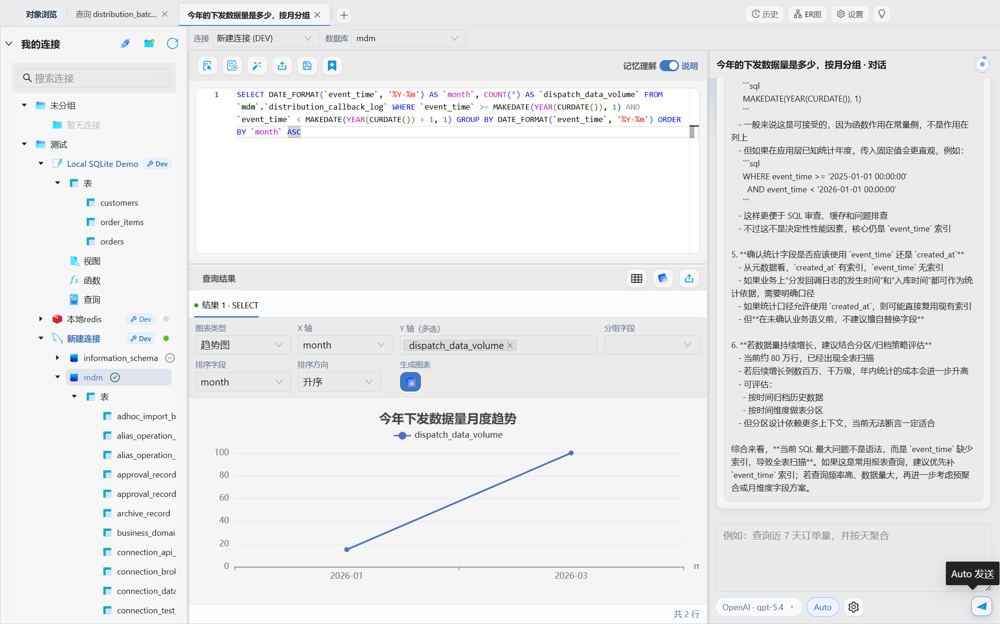

当你关心筛选条件是否合理、索引是否可能命中、有没有更稳妥的改写方式时，可以继续让 AI 基于当前 SQL 和上下文给出分析意见。

### 6. 有价值的查询可以沉淀成样例 SQL

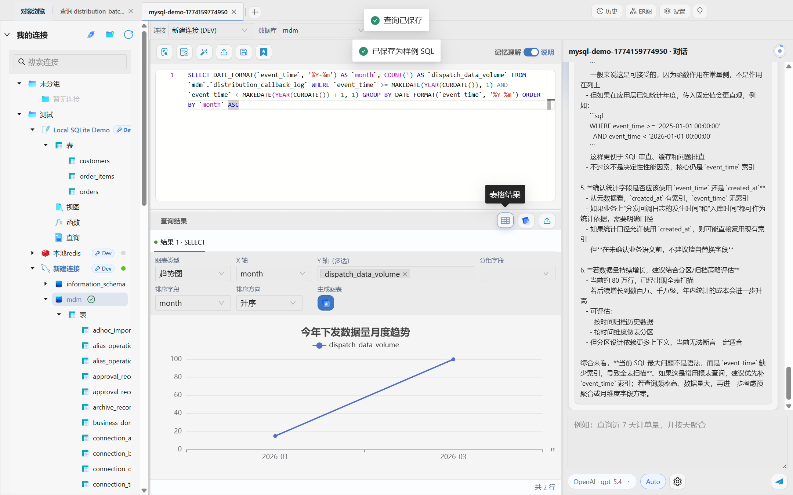

临时完成的一次查询，可以顺手保存成样例 SQL。后续再问类似问题时，AI 能更快贴近你的业务语境。

### 7. 表数据筛选、排序和详情查看都在一个界面里

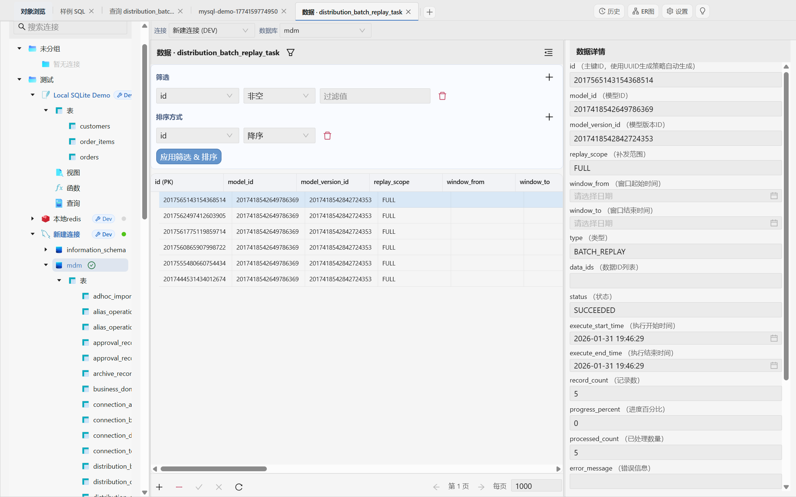

定位数据问题时，不需要在多个工具之间来回切换，筛选、排序、查看详情可以连续完成。

### 8. 表结构和对象定义支持可视化查看与编辑

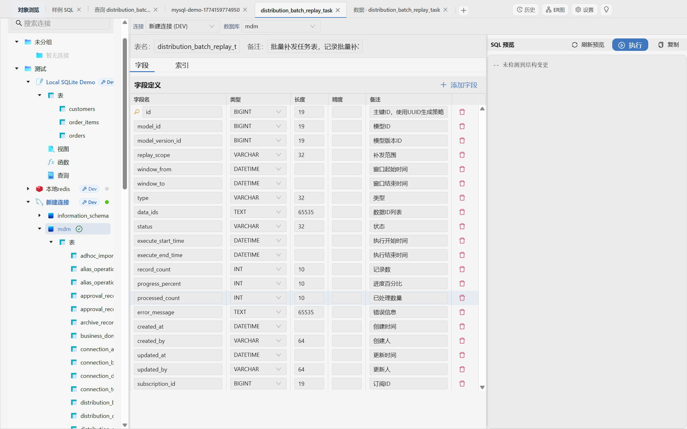

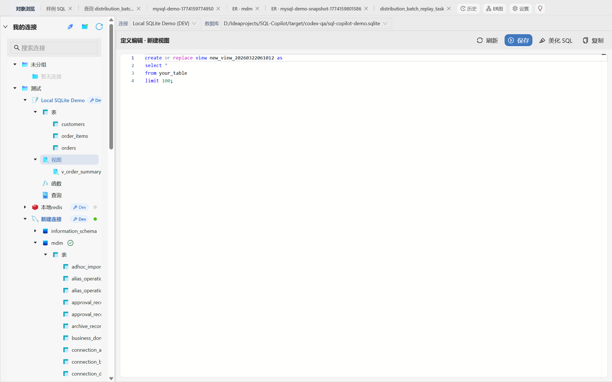

除了查数据，也能处理表结构、索引、视图定义等对象级工作。

### 9. ER 图和关系快照帮助快速理解复杂库

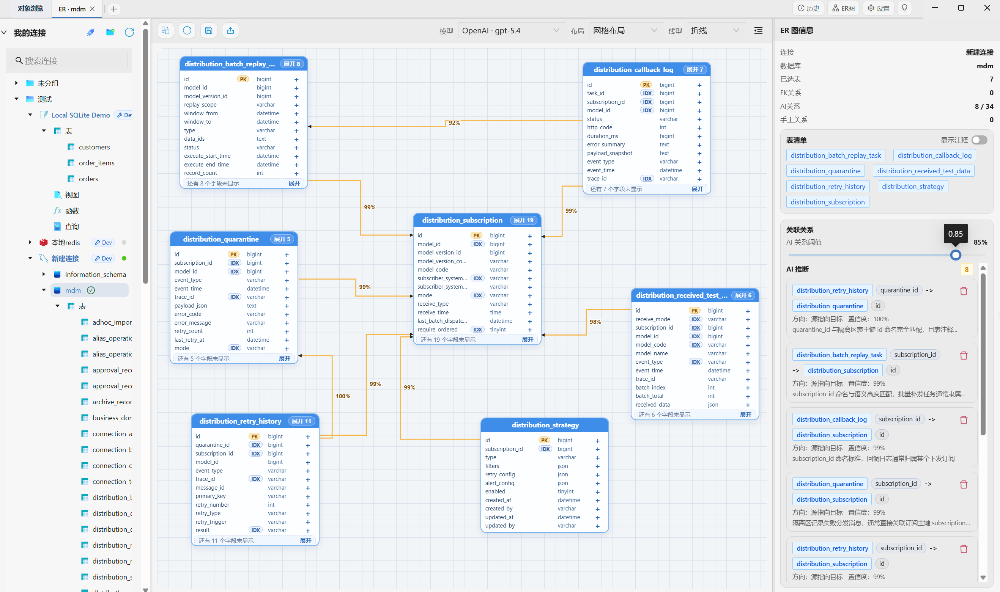

从真实对象生成 ER 图，保留快照，后续可以继续围绕同一批表做结构分析和沟通。

### 10. 设置页支持语言、主题和模型配置


支持中英文界面切换，也能灵活接入自己的模型配置，适合在本地环境里长期使用。

## 一条更顺手的 SQL 工作流

1. 连接数据库，让工作台先拿到真实的 Schema 和对象上下文。
2. 用自然语言描述需求，AI 生成 SQL 并回填到编辑器。
3. 直接执行结果，继续做 Explain、分析、图表或导出。
4. 如果字段、条件或方言不对，就在同一上下文里继续修复。
5. 将高价值结果保存为样例 SQL、历史会话或 ER 快照，方便复用。

## 核心能力

### 1. 面向数据库工作的 AI 对话

- 对话式 SQL 生成、SQL 解释、SQL 分析、图表方案生成、SQL 修复都已落地。
- SSE 流式输出支持 `thinking` 与最终结果分段展示，便于观察 AI 的处理过程。
- 查询结果可直接回填到 SQL 编辑器，再进入执行、Explain 或风险评估。

### 2. 真正带上下文的 SQL Copilot

- 当前实现会组合 Schema 表、字段、术语、样例 SQL、历史 SQL、多轮会话窗口与长期记忆。
- 会话上下文不是简单拼接原文，而是支持窗口摘要、滑动摘要、结构化窗口 JSON 与长期向量记忆召回。
- 长期记忆写入 `session_summary` 向量记忆，默认保留 30 天。

### 3. 查询不是终点，执行闭环才是重点

- 生成 SQL 后可直接执行。
- 执行前会先做风险评估，拦截高风险操作和只读连接违规写入。
- 结果可以表格化查看、转图表、缓存图表图片、导出 CSV。

### 4. 不只有 AI，会把数据库工作台补全

- 连接管理：创建、编辑、删除、测试、数据库列表预览。
- 对象浏览：数据库/表/视图等对象树、表概览、表统计、对象详情。
- 表设计：支持新建表、修改表、DDL 预览与执行。
- 数据编辑：支持表数据页的筛选、排序、单元格编辑和提交。
- ER 图：支持外键关系 + AI 推断关系、快照保存与恢复。
- 知识库：术语管理、样例 SQL 管理、知识向量重建。
- 历史中心：会话分页查看、恢复打开、删除、标题重命名。

### 5. 本地桌面交付，不依赖浏览器页面拼装

- Electron 主进程负责窗口、图表缓存、本地资源与打包态子进程托管。
- 打包时会把 backend 和 Qdrant 资源一起准备好，桌面端不是“只有一个前端壳”。
- `scripts/package-variants.mjs` 会为 backend 执行 Maven 打包，再通过 `jdeps + jlink` 生成裁剪运行时。

## 当前已实现模块

| 模块 | 当前实际能力 |
| --- | --- |
| 连接与对象浏览 | 连接管理、数据库列表、对象树、表统计、对象详情、右键快捷动作 |
| AI 查询 | 生成 SQL、自动模式、解释 SQL、分析 SQL、生成图表、修复 SQL、SSE 流式输出 |
| SQL 执行 | 执行、Explain、风险评估、结果展示、CSV 导出 |
| Schema / 表设计 | Schema 同步、表详情、对象名补全、建表/改表/删表/清表 |
| 表数据 | 分页、筛选、排序、编辑、提交 |
| ER 图 | 外键关系、AI 推断关系、快照保存/改名/删除/重开 |
| 历史 | 会话分页、历史恢复、删除、标题覆写 |
| 知识库 | 术语、样例 SQL、从查询保存样例、重建向量 |
| RAG | 表/字段/历史/术语/样例 SQL 多桶检索、rerank、跨作用域召回 |

## 技术栈

### 桌面端

| 技术 | 实际版本/实现 | 说明 |
| --- | --- | --- |
| Electron | 36.2.1 | 桌面容器与本地资源调度 |
| Vue 3 | 3.5.13 | 渲染层框架 |
| TypeScript | 5.7.2 | 前端类型系统 |
| Ant Design Vue | 4.2.6 | UI 组件库 |
| Vite | 6.0.5 | 前端构建与预览 |
| Monaco Editor | 0.55.1 | SQL 编辑与补全 |
| ECharts | 5.6.0 | 图表与 ER 图渲染 |

### 后端

| 技术 | 实际版本/实现 | 说明 |
| --- | --- | --- |
| Spring Boot | 3.3.4 | 本地 HTTP 服务 |
| Java | 17 | 后端运行与打包基线 |
| MyBatis Spring Boot | 3.0.5 | SQLite 持久化访问 |
| SQLite JDBC | 3.46.0.0 | 本地元数据库 |
| Spring AI Core | 1.0.0-M6 | AI 接入基础依赖 |
| JSQLParser | 4.9 | SQL AST 校验与表名提取 |
| JSch | 0.2.20 | SSH 隧道支持 |

### AI / RAG / 本地推理

| 技术 | 实际版本/实现 | 说明 |
| --- | --- | --- |
| Qdrant | Electron 资源内置二进制 | 向量数据库 |
| ONNX Runtime | 1.19.2 | 本地 embedding / rerank 推理 |
| DJL Tokenizers | 0.29.0 | 本地 tokenizer |
| OpenAI Compatible API | 已接入 | 在线模型、在线 embedding / rerank |
| BGE-M3 / BGE-Reranker | 外部下载 + 本地目录配置 | 保留 ONNX 框架能力，但打包产物默认不携带模型文件 |

## 项目结构

```text
.
├── apps/desktop                    Electron + Vue 桌面端
│   ├── electron                    主进程与 preload
│   ├── src/modules/studio          主工作台与功能模块
│   └── resources                   Qdrant 与打包态 backend 资源
├── apps/server                     Spring Boot 本地服务
│   ├── controller                  HTTP 接口
│   ├── service                     业务服务
│   ├── service/llm                 LLM 网关
│   ├── service/rag                 检索、向量化、rerank
│   ├── mapper/entity               SQLite 持久化
│   └── resources                   application.yml / schema.sql / drivers
├── packages/shared-contracts       前后端共享契约
├── pages                           对外说明页与发布素材
├── scripts/package-variants.mjs    单包打包脚本
└── docs                            文档、阶段总结与产品资料
```

## 开发命令

### 前端开发

```bash
npm run -w @sqlcopilot/desktop dev:renderer
npm run -w @sqlcopilot/desktop dev:electron
npm run -w @sqlcopilot/desktop debug
```

### 前端校验与预览

```bash
npm run type-check
npm run build
npm run -w @sqlcopilot/desktop preview -- --host 127.0.0.1 --port 8888 --strictPort
```

### 后端开发与校验

```bash
mvn -f apps/server/pom.xml clean spring-boot:run
mvn -f apps/server/pom.xml clean package
```

### 桌面端打包

```bash
npm run -w @sqlcopilot/desktop dist
```

### 一键打包

```bash
npm run package:app
```

如仅需当前宿主平台制品，可使用：

```bash
npm run package:app:host
```

## 打包说明

当前默认会输出四个平台桌面制品，分别位于 `release/desktop/win-x64`、`release/desktop/mac-arm64`、`release/desktop/mac-x64`、`release/desktop/linux-x64`。

- 打包命令统一使用 `npm run package:app`。
- 如只需当前宿主平台，可执行 `npm run package:app:host`。
- 打包流程会自动为 backend 执行 Maven 构建，并通过 `jdeps + jlink` 生成随桌面端一起分发的运行时。
- 前端仍保留本地 ONNX / 在线两种 RAG 运行方式，但安装包默认不内置模型文件，需要用户自行下载并配置本地模型目录。

## 模型下载

- Embedding 模型：
  - https://huggingface.co/hooman650/bge-m3-onnx-o4/tree/main
- Rerank 模型：
  - https://huggingface.co/swulling/bge-reranker-base-onnx-o4/tree/main
- 在桌面应用设置中点击下载链接时，会直接调用系统默认浏览器打开，不会在应用内弹窗下载。

## 开源协议

本项目采用 MIT License，详见仓库根目录的 `LICENSE` 文件。

## 启动检查

- 后端健康检查：`http://127.0.0.1:18080/api/health`
- 前端 API 默认直连：`http://localhost:18080`
- 本地元数据默认落在工程根目录：`sql-copilot.db`
- 更详细的代码级说明见 `docs/20260311160122-technical-architecture.md`
