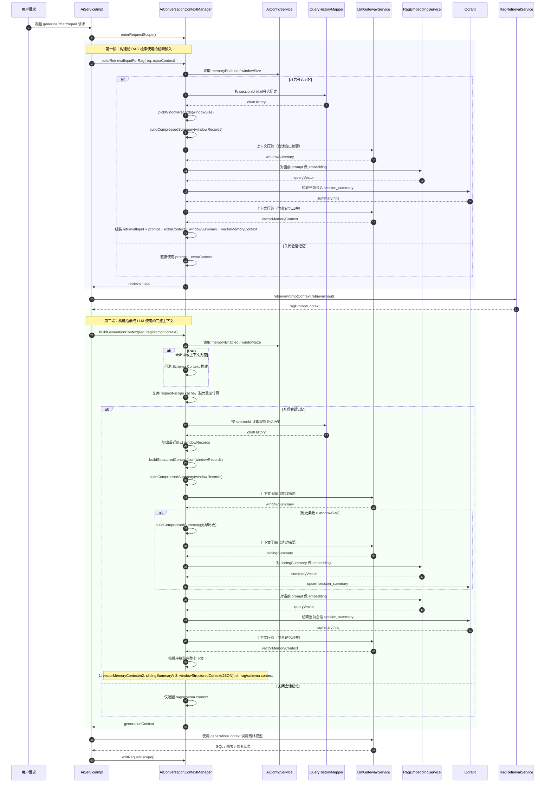

# 主题：context-memory-refactor

## 记录

### 2026-03-11 14:48:53

## 追加记录（2026-03-11）- AI 对话上下文管理抽取

### 本次目标
- 分析并抽离后端 AI 对话上下文管理逻辑，降低 `AiServiceImpl` 的耦合度。
- 为上下文构建关键步骤补充必要中文注释，方便后续继续优化记忆、压缩和召回策略。

### 关键改动
- 新增后端独立组件：`apps/server/src/main/java/com/sqlcopilot/studio/service/impl/AiConversationContextManager.java`。
- 将以下能力从 `AiServiceImpl` 抽离到独立组件：
  - 会话记忆开关判定
  - 检索输入构建
  - 最近窗口对话构建
  - 意图识别历史上下文拼装
  - 生成链路上下文组装
  - 会话历史压缩、结构化窗口生成、session summary 向量写入与召回
  - 请求级上下文缓存作用域管理
- `AiServiceImpl` 改为通过 `AiConversationContextManager` 获取上下文，只保留主流程编排、trace 组装和模型调用。
- 调整生成/图表/修复链路的 prompt 组装，复用已经计算出的 `retrievalInputForPrompt`，避免在最终模型调用前再次重复构建一轮带记忆的检索输入。
- 在新组件和关键接入点添加中文注释，明确每一步的作用和边界。

### 验证结果
- 后端编译：`mvn -f apps/server/pom.xml -DskipTests compile` 通过。
- 后端打包：`mvn -f apps/server/pom.xml clean package` 通过。
- 后端 clean 启动：`mvn -f apps/server/pom.xml clean spring-boot:run -Dspring-boot.run.arguments=--server.port=18082` 启动成功。
- 后端健康检查：`http://127.0.0.1:18082/api/health` 返回 `{"code":0,"message":"success","data":"ok"}`。
- 前端 clean 构建：`npm run -w @sqlcopilot/desktop build -- --emptyOutDir` 通过。
- 前端预览：`npm run -w @sqlcopilot/desktop preview -- --host 127.0.0.1 --port 18091 --strictPort` 启动成功，`curl -I http://127.0.0.1:18091` 返回 `HTTP/1.1 200 OK`。

### 备注
- 本次改动未调整对外 HTTP API，也未改动前端会话展示逻辑，属于后端内部上下文管理重构。
- 保持 UTF-8 编码。

---

## 追加记录（2026-03-11）- 上下文压缩时序图

### 说明
- 该时序图描述当前 `AiConversationContextManager` 中“上下文压缩 + 会话记忆召回 + 最终上下文组装”的主流程。
- 图中同时覆盖两条路径：
  - 给 RAG 检索使用的轻量记忆路径
  - 给最终 LLM 生成使用的完整上下文路径

### Mermaid 时序图

### 验证结果
- 后端 clean 启动：`mvn -f apps/server/pom.xml clean spring-boot:run -Dspring-boot.run.arguments=--server.port=18083` 启动成功。
- 后端健康检查：`http://127.0.0.1:18083/api/health` 返回 `{"code":0,"message":"success","data":"ok"}`。
- 前端 clean 构建：`npm run -w @sqlcopilot/desktop build -- --emptyOutDir` 通过。
- 前端预览：`npm run -w @sqlcopilot/desktop preview -- --host 127.0.0.1 --port 18092 --strictPort` 启动成功，`curl -I http://127.0.0.1:18092` 返回 `HTTP/1.1 200 OK`。

### 2026-03-11 15:14:56

## 追加记录（2026-03-11）- 上下文优化与会话记忆 TTL

### 本次目标
- 优化当前 AI 对话上下文管理流程，解决意图历史结构失真、最终 prompt 记忆重复注入、Schema fallback 与意图检索输入不一致的问题。
- 为历史会话记忆增加 TTL，默认保留 30 天，避免旧记忆长期累积后持续参与召回。

### 关键改动
- 调整 `AiConversationContextManager` 的意图最近对话输出结构：改为 `turnType/userPrompt/assistantReply/sqlOutput/actionType/database`，不再把整条历史错误标记成 `role=user`。
- 调整生成链路上下文组装接口，`buildGenerationContext(...)` 直接接收已经整理好的 `retrievalPromptHint`，避免最终 prompt 再次重复拼入同一批会话记忆。
- `Schema fallback` 改为复用意图识别后的检索提示，而不是退回原始用户问题，保证检索与回退上下文语义一致。
- 为 `session_summary` 向量记忆增加 TTL 元数据：写入 `memory_ttl_days=30` 和 `expires_at`，并在向量召回时过滤掉已过期记忆。
- 为兼容旧 payload，召回过滤同时支持 `expires_at` 和基于 `updated_at/created_at` 的兜底过期判断。
- 适当放宽会话记忆召回条数上限到 10 条，再由压缩逻辑进行归并，减少因为单条记忆命中偏差导致的上下文缺失。
- 在新增或调整的关键步骤补充中文注释，说明去重、TTL、Schema fallback 复用的原因。

### 验证结果
- 后端编译：`mvn -f apps/server/pom.xml -DskipTests compile` 通过。
- 后端打包：`mvn -f apps/server/pom.xml clean package` 通过。
- 后端 clean 启动：`mvn -f apps/server/pom.xml clean spring-boot:run -Dspring-boot.run.arguments=--server.port=18084` 启动成功。
- 后端健康检查：`http://127.0.0.1:18084/api/health` 返回 `{"code":0,"message":"success","data":"ok"}`。
- 前端 clean 构建：`npm run -w @sqlcopilot/desktop build -- --emptyOutDir` 通过。
- 前端类型检查：`npm run -w @sqlcopilot/desktop type-check` 通过。
- 前端预览：`npm run -w @sqlcopilot/desktop preview -- --host 127.0.0.1 --port 18093 --strictPort` 启动成功，`curl -I http://127.0.0.1:18093` 返回 `HTTP/1.1 200 OK`。

### 备注
- 当前 TTL 采用代码默认值 30 天，暂未开放为可配置项。
- 现有向量库中的历史 `session_summary` 即使没有 `expires_at` 字段，也会按 `updated_at/created_at + 30天` 参与兜底过期判断。

### 2026-03-11 15:40:19

## 追加记录（2026-03-11）- Token 窗口自动压缩

### 本次目标
- 将 AI 对话上下文压缩触发条件从“固定窗口/固定压缩”调整为“基于 token 窗口预算 + 自动压缩比例”的策略。
- 新增可配置项，使桌面端可直接配置最近原文最大轮数、记忆窗口 token 上限和自动压缩触发比例。

### 关键改动
- AI 配置新增两个字段：`conversationMemoryWindowTokens` 与 `conversationAutoCompressRatio`，并同步打通后端 DTO/VO、实体、Mapper、SQLite schema、迁移逻辑与桌面端配置表单。
- `AiConversationContextManager` 新增 token 预算策略：
  - 最近原文窗口按“轮数上限 + token 上限”双重约束截取。
  - 当最近窗口 token 达到 `windowTokens * autoCompressRatio` 时，生成 `windowSummary`。
  - 超出最近原文窗口的更早历史折叠为 `slidingSummary`，继续写入 session summary 向量记忆。
  - 未达到压缩阈值时，RAG 检索输入直接携带最近会话原文；达到阈值后，改为“最近摘要 + 原文尾部”组合。
- 最终生成上下文增加 `Conversation Recent Summary` 段，确保触发压缩后模型仍能看到最近窗口的压缩语义和最新原文尾部。
- token 估算优先复用 `query_history.token_estimate`，缺失时回退到基于文本长度的粗略估算。
- 保留 30 天 session summary TTL 逻辑不变，与本次 token 窗口压缩策略共同生效。

### 验证结果
- 后端编译：`mvn -f apps/server/pom.xml -DskipTests compile` 通过。
- 后端 clean 打包：`mvn -f apps/server/pom.xml clean package` 通过。
- 后端 clean 启动：`mvn -f apps/server/pom.xml clean spring-boot:run -Dspring-boot.run.arguments=--server.port=18085` 启动成功。
- 后端健康检查：`http://127.0.0.1:18085/api/health` 返回 `{"code":0,"message":"success","data":"ok"}`。
- 前端类型检查：`npm run -w @sqlcopilot/desktop type-check` 通过。
- 前端 clean 构建：`npm run -w @sqlcopilot/desktop build -- --emptyOutDir` 通过。
- 前端预览：`npm run -w @sqlcopilot/desktop preview -- --host 127.0.0.1 --port 18094 --strictPort` 启动成功，`curl -I http://127.0.0.1:18094` 返回 `HTTP/1.1 200 OK`。

### 备注
- 当前实现仍保留 `conversationMemoryWindowSize` 作为最近原文轮数安全上限，防止极多短消息导致结构化窗口无界增长。
- 自动压缩比例默认值为 `0.75`，记忆窗口 token 默认值为 `6000`。

### 2026-03-11 15:51:35

## 追加记录（2026-03-11）- 会话窗口上下文占比环形指示器

### 本次目标
- 将会话窗口右上角和输入区工具栏中的 `≈Token` 文本改为类似 Codex 的环形上下文占比指示器。
- hover 时展示当前窗口已占用 token、总窗口 token 和当前占比，便于直观看到上下文预算使用情况。

### 关键改动
- 新增前端运行时上下文占比计算：基于当前会话消息、`conversationMemoryWindowSize` 和 `conversationMemoryWindowTokens`，估算最近窗口实际占用 token，并输出 `usedTokens/totalTokens/percent/tone`。
- 会话标题栏右上角的 token 文本替换为环形占比指示器；输入区右侧工具栏的 token 文本也同步替换，保持一致。
- ring 样式使用 conic-gradient 构造圆环，并按占比切换 `idle/normal/warning/danger` 颜色层级；对话记忆关闭时显示为禁用态。
- tooltip 增加“当前占用 / 总窗口 / 当前占比”信息，关闭对话记忆时补充“仅为估算参考值”说明。

### 验证结果
- 前端类型检查：`npm run -w @sqlcopilot/desktop type-check` 通过。
- 前端 clean 构建：`npm run -w @sqlcopilot/desktop build -- --emptyOutDir` 通过。
- 后端 clean 启动：`mvn -f apps/server/pom.xml clean spring-boot:run -Dspring-boot.run.arguments=--server.port=18086` 启动成功。
- 后端健康检查：`http://127.0.0.1:18086/api/health` 返回 `{"code":0,"message":"success","data":"ok"}`。
- 前端预览：`npm run -w @sqlcopilot/desktop preview -- --host 127.0.0.1 --port 18095 --strictPort` 启动成功，`curl -I http://127.0.0.1:18095` 返回 `HTTP/1.1 200 OK`。

### 备注
- 当前占比为前端按最近消息窗口做的估算值，目标是与后端 token 窗口策略保持近似一致，但不依赖额外接口返回。
