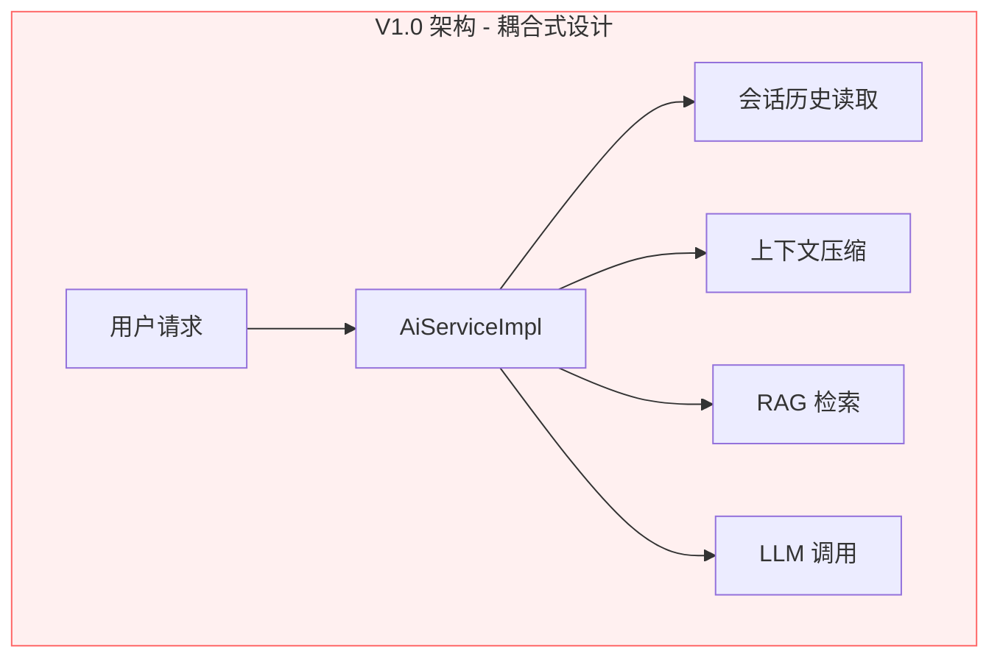
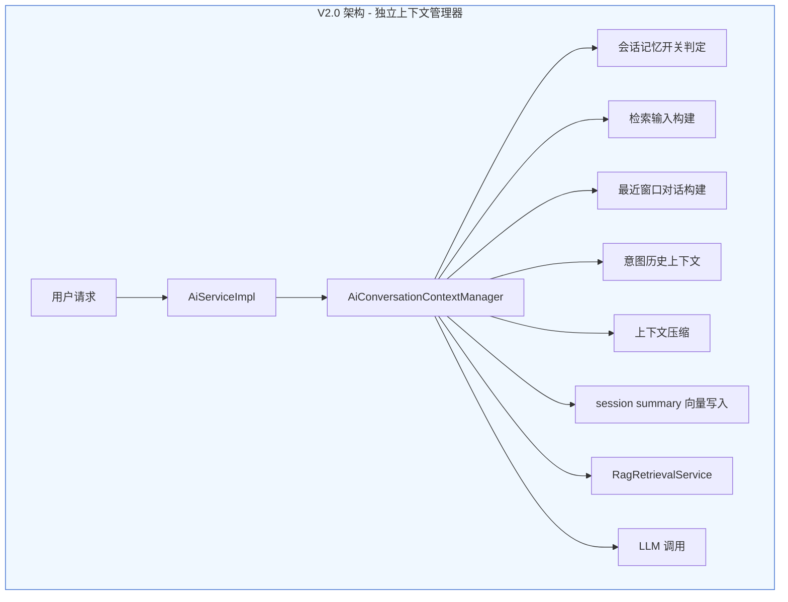
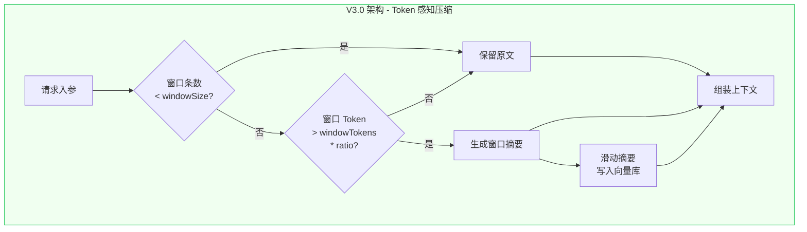
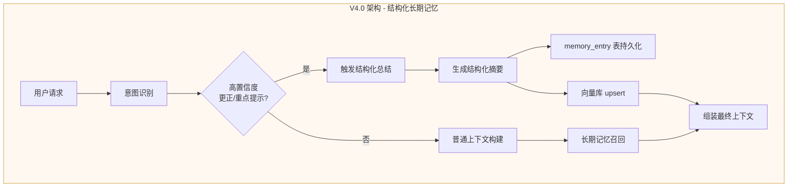
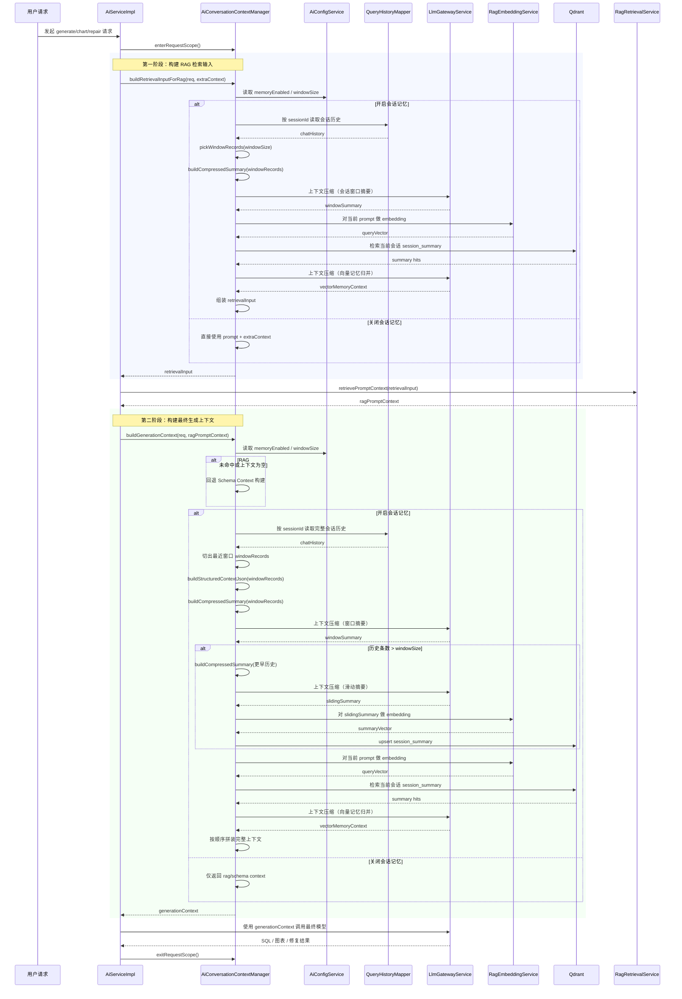
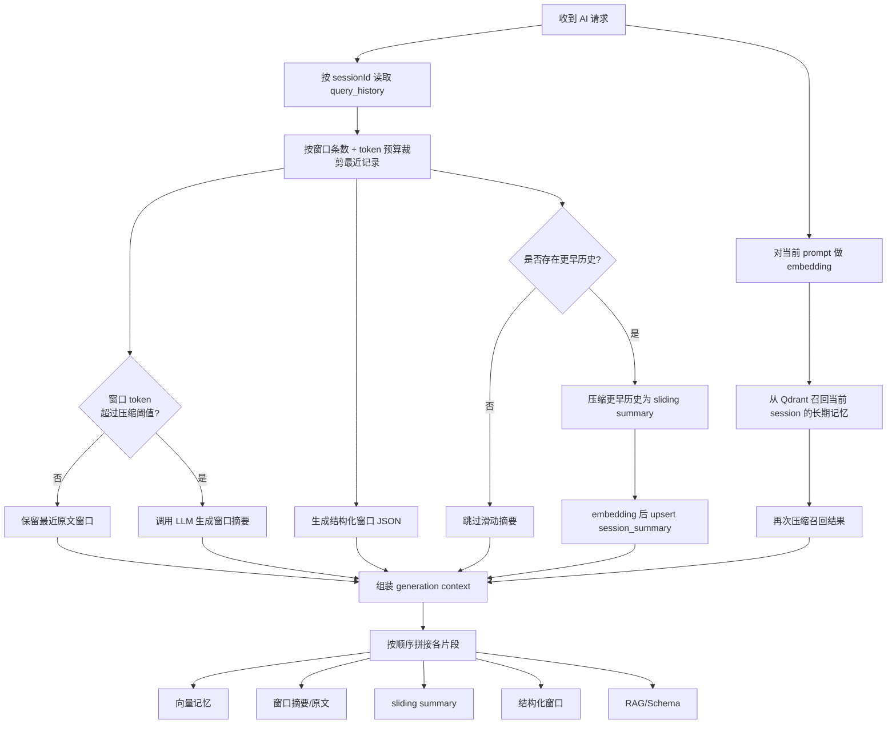
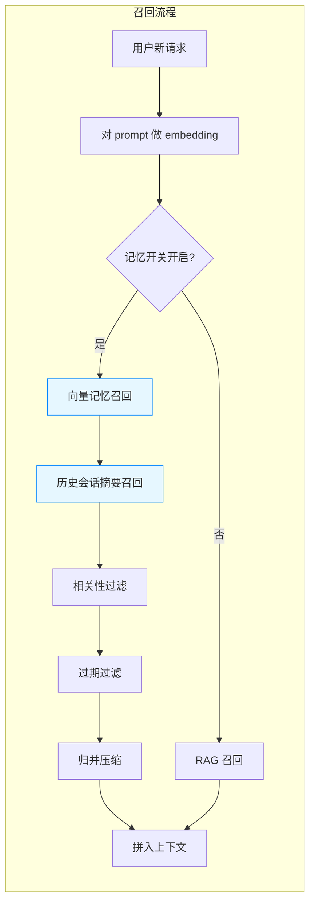
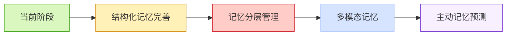

# NL2SQL 业务场景下的上下文与记忆管理架构演进

## 1. 背景与概述

### 1.1 NL2SQL 场景下的核心挑战

在 NL2SQL（自然语言转 SQL）业务场景中，AI 对话系统面临诸多独特挑战：

- **上下文依赖性强**：用户的查询意图往往需要结合会话历史才能完整理解
- **Schema 感知需求**：需要实时获取数据库表结构、字段关系、外键约束等信息
- **Token 成本控制**：大模型调用按 Token 计费，需要精细化管理上下文长度
- **记忆有效性**：过期的记忆可能导致模型产生错误理解，需要建立有效的遗忘机制

SQL Copilot 作为一款 AI 原生数据库管理工具，在实现智能对话能力的过程中，逐步构建了一套完整的上下文与记忆管理体系。本文将深入剖析该体系的设计理念、架构演进和技术实现。

### 1.2 核心设计目标

```
┌─────────────────────────────────────────────────────────────────────┐
│                     上下文与记忆管理核心目标                          │
├─────────────────────────────────────────────────────────────────────┤
│  1. 上下文感知：让 AI 理解会话历史，准确把握用户意图                    │
│  2. 成本优化：通过压缩与摘要控制 Token 消耗                           │
│  3. 长期记忆：通过向量检索实现跨会话信息复用                          │
│  4. 结构化存储：让记忆可管理、可追溯、可失效                           │
│  5. 架构解耦：降低核心服务耦合，提升可维护性                          │
└─────────────────────────────────────────────────────────────────────┘
```


## 2. 架构演进历程

### 2.1 V1.0 时代：耦合式上下文管理

**时间**：2026 年 3 月初

**架构特点**：所有上下文管理逻辑直接嵌入 `AiServiceImpl`，缺乏独立抽象。



**存在问题**：
- 上下文构建逻辑与主服务强耦合
- 无法独立测试和复用
- 意图历史结构失真
- 重复计算导致性能浪费

### 2.2 V2.0 时代：独立上下文管理器

**时间**：2026 年 3 月 11 日

**关键改动**：抽离 `AiConversationContextManager` 组件，实现关注点分离。



**核心改进**：
- 独立的上下文管理器组件
- 请求级作用域缓存（ThreadLocal）
- 会话历史压缩与滑动摘要
- Session summary 向量写入与召回

### 2.3 V3.0 时代：Token 感知压缩

**时间**：2026 年 3 月 11 日（后续迭代）

**关键改动**：从固定窗口压缩升级为基于 Token 预算的自动压缩策略。



**核心参数**：
- `conversationMemoryWindowSize`：最近原文最大轮数（默认 12，范围 4-50）
- `conversationMemoryWindowTokens`：记忆窗口 token 上限（默认 6000，范围 512-32000）
- `conversationAutoCompressRatio`：自动压缩触发比例（默认 0.75）

### 2.4 V4.0 时代：结构化长期记忆

**时间**：2026 年 3 月 27 日

**关键改动**：从双轨记忆（历史 SQL + 长期记忆）收敛为单一结构化长期记忆池。



**核心改进**：
- 停止自动写入 `sql_history/history_query` 向量
- 升级为结构化摘要（`MemoryStructuredSummaryVO`）
- 上下文压缩与"更正/重点提示"两类高价值时机触发
- 前端收敛为单一长期记忆管理入口


## 3. 核心模块设计

### 3.1 上下文管理器（AiConversationContextManager）

这是整个上下文与记忆体系的核心组件，负责：

| 功能 | 说明 |
|------|------|
| 会话记忆开关判定 | 优先请求级开关，其次全局配置 |
| 检索输入构建 | 为 RAG 检索准备轻量输入 |
| 最近窗口对话构建 | 截取最近 N 轮对话 |
| 意图历史上下文 | 支持 Auto 模式的意图链 |
| 上下文压缩 | Token 感知自动压缩 |
| 向量记忆召回 | 跨会话长期记忆检索 |
| 最终上下文组装 | 统一拼装生成上下文 |

### 3.2 长期记忆服务（MemoryService）

负责结构化长期记忆的 CRUD 操作：

```java
public class MemoryServiceImpl implements MemoryService {
    // 核心能力
    - 手工长期记忆保存（自动生成最小结构化摘要）
    - 自动长期记忆 upsert（按 scope + connectionId + databaseName + sourceSessionId）
    - 长期记忆向量文本基于结构化摘要展平
    - 旧 sql_history 集合清理
}
```

### 3.3 向量存储（Qdrant）

使用 Qdrant 作为向量存储引擎，支撑两类向量检索：

```
┌─────────────────────────────────────────────────────────────┐
│                      Qdrant 向量集合                         │
├─────────────────────────────────────────────────────────────┤
│  managed_memory                                             │
│  ├── session_summary (会话摘要向量)                          │
│  ├── correction (纠正信息向量)                               │
│  ├── priority_hint (重点提示向量)                            │
│  └── manual (手工记忆向量)                                   │
├─────────────────────────────────────────────────────────────┤
│  schema_table / schema_column                               │
│  ├── 表结构向量                                              │
│  └── 字段向量                                                │
├─────────────────────────────────────────────────────────────┤
│  sql_history                                                │
│  ├── example_sql (样例 SQL 向量)                            │
│  └── ql_fragment (SQL 片段向量)                             │
└─────────────────────────────────────────────────────────────┘
```


## 4. 上下文管理详细流程

### 4.1 完整请求处理时序图



### 4.2 上下文压缩流程



### 4.3 结构化摘要生成

当触发结构化总结时，使用专门的 LLM prompt 生成结构化记忆：

```json
{
  "memoryType": "SESSION_SUMMARY|CORRECTION|PRIORITY_HINT|MANUAL",
  "facts": ["用户关注订单金额统计", "常用 date_range 字段"],
  "constraints": ["仅查询近30天数据", "排除测试环境"],
  "corrections": ["之前误用了 created_at，应使用 order_date"],
  "priorityHints": ["必须包含毛利率计算"],
  "relatedTables": ["orders", "order_items", "products"],
  "confidence": 0.85,
  "summaryText": "用户主要关注订单金额相关统计查询..."
}
```


## 5. 记忆管理体系

### 5.1 记忆类型划分

```
┌─────────────────────────────────────────────────────────────────────┐
│                         记忆类型体系                                  │
├─────────────────────────────────────────────────────────────────────┤
│                                                                     │
│  ┌─────────────────┐    ┌─────────────────┐    ┌───────────────┐ │
│  │  会话级记忆      │    │  长期记忆        │    │   知识记忆     │ │
│  │  (会话窗口内)    │    │  (跨会话持久化)   │    │  (知识库)      │ │
│  ├─────────────────┤    ├─────────────────┤    ├───────────────┤ │
│  │ • 最近 N 轮原文  │    │ • 结构化摘要     │    │ • 术语定义     │ │
│  │ • 窗口摘要       │    │ • 纠正信息       │    │ • 样例 SQL    │ │
│  │ • 结构化 JSON   │    │ • 重点提示       │    │ • 表结构描述   │ │
│  │ • 滑动摘要      │    │ • 手工记忆       │    │ • 业务说明     │ │
│  └─────────────────┘    └─────────────────┘    └───────────────┘ │
│                                                                     │
└─────────────────────────────────────────────────────────────────────┘
```

### 5.2 记忆召回策略



### 5.3 TTL 过期机制

为防止记忆无限累积，引入 TTL 机制：

- **Session Summary TTL**：默认 30 天
- **写入时携带**：`memory_ttl_days=30` 和 `expires_at`
- **召回时过滤**：过滤掉已过期记忆
- **兜底策略**：基于 `updated_at/created_at + 30天` 判断


## 6. 前端交互支持

### 6.1 记忆开关语义拆分

在 V2.0 时代，将原有的单一"记忆"开关拆分为：

```
┌─────────────────────────────────────────────────────────────┐
│                    记忆开关拆分                              │
├─────────────────────────────────────────────────────────────┤
│                                                             │
│   ┌─────────────────┐       ┌─────────────────┐           │
│   │   长对话         │       │   记忆理解       │           │
│   │ (会话上下文记忆)  │       │ (SQL 持久记忆)   │           │
│   ├─────────────────┤       ├─────────────────┤           │
│   │ • 连续对话       │       │ • 执行 SQL 记忆  │           │
│   │ • 意图连贯       │       │ • 自动沉淀       │           │
│   │ • 上下文复用     │       │ • 向量化检索     │           │
│   └─────────────────┘       └─────────────────┘           │
│                                                             │
└─────────────────────────────────────────────────────────────┘
```

### 6.2 上下文占比可视化

提供类似环形进度条的上下文占比指示器：

- **usedTokens**：当前窗口已占用 token
- **totalTokens**：总窗口 token 预算
- **percent**：当前占比
- **tone**：颜色层级（idle/normal/warning/danger）


## 7. 架构优化总结

### 7.1 关键优化点

| 阶段 | 优化项 | 效果 |
|------|--------|------|
| V1→V2 | 上下文管理器抽离 | 降低耦合，提升可维护性 |
| V2→V3 | Token 感知压缩 | 精细化控制成本 |
| V3→V4 | 结构化长期记忆 | 记忆可解释、可管理 |
| 全链路 | 请求级缓存 | 避免重复计算 |
| 全链路 | Schema fallback 复用 | 意图信息不丢失 |
| 全链路 | TTL 过期机制 | 防止记忆膨胀 |

### 7.2 技术指标

```
┌─────────────────────────────────────────────────────────────┐
│                      关键配置参数                            │
├─────────────────────────────────────────────────────────────┤
│  窗口条数：windowSize = 12 (范围 4-50)                       │
│  窗口 Token：windowTokens = 6000 (范围 512-32000)           │
│  压缩阈值：autoCompressRatio = 0.75 (范围 0.30-0.95)         │
│  摘要 TTL：memoryTtlDays = 30                               │
│  召回上限：maxRecall = 10 条                                │
└─────────────────────────────────────────────────────────────┘
```

### 7.3 架构演进启示

1. **从耦合到解耦**：核心逻辑需要独立抽象，便于测试和演进
2. **从粗放到精细**：Token 感知是成本控制的关键
3. **从无结构到结构化**：结构化让记忆可解释、可管理
4. **从单向到闭环**：记忆的写入、召回、过期需要完整闭环


## 8. 未来展望

### 8.1 潜在优化方向

- **多模态记忆**：支持图表、Schema 快照等非文本记忆
- **主动记忆**：基于用户行为预测性加载相关记忆
- **记忆分层**：区分"工作记忆"和"长期记忆"层级
- **个性化压缩**：根据用户习惯动态调整压缩策略

### 8.2 技术演进路线




## 9. 总结

本文深入剖析了 SQL Copilot 在 NL2SQL 业务场景下的上下文与记忆管理体系的完整演进历程。从最初的耦合式设计，到独立的上下文管理器，再到 Token 感知的自动压缩，最终演进为结构化的长期记忆体系，每一次迭代都解决了实际业务中的具体问题。

核心价值体现在：

1. **架构解耦**：独立的 `AiConversationContextManager` 组件降低了系统复杂度
2. **成本优化**：Token 感知压缩策略实现了精细化的成本控制
3. **记忆升级**：从无结构的会话历史到结构化的长期记忆，让 AI 更好地理解用户意图
4. **可观测性**：TTL 机制和前端可视化让记忆系统透明可追溯

这套体系不仅服务于 NL2SQL 场景，其设计理念和实现方案对于其他需要上下文管理的 AI 应用也具有参考价值。


*文档生成时间：2026-03-28*
*项目：SQL Copilot*
*主题：NL2SQL 上下文与记忆管理架构*

---

## 追加记录（2026-03-28）- 上下文窗口 Token 预算统一改造

### 本次目标
- 修正历史记录中 token 字段的语义混用问题，彻底区分“单轮内容 token”“单次请求消耗 token”“最终 prompt 预算快照”。
- 将分散在前后端各处的 `/4` 启发式估算收口到统一后端服务。
- 把原先只约束“历史窗口”的粗粒度裁剪，升级为“最终 prompt 预算闭环”。
- 让桌面端显示的上下文占用与后端真实裁剪逻辑保持一致。

### 关键改动
- 后端新增 `TokenEstimatorService`，统一提供：
  - `estimateTokens(text, tokenizerType)`
  - `estimateTurnContentTokens(...)`
  - token 来源 / 版本 / scope 常量
- 后端新增 `PromptBudgetPlanner`，在真正调用模型前统一规划：
  - `system prompt`
  - 数据库基本信息
  - 表使用硬约束
  - 当前用户输入
  - 检索增强输入
  - `windowSummary`
  - `slidingSummary`
  - `windowStructuredContext`
  - `windowDialogContext`
  - `knowledgeContext`
- `PromptBudgetPlanner` 统一保证：
  - `promptTokens + completionReserveTokens + safetyMarginTokens <= contextWindowTokens`
  - 超限时按“最近原文 -> sliding summary -> 结构化上下文 -> RAG/schema -> 最近摘要”的顺序裁剪
- `AiConversationContextManager` 改造：
  - 会话窗口预算只读取 `turn_content_tokens`
  - 缺失时按单条历史自身内容懒估算，不再回退到“整次请求 total token”
  - 修正 `resolveRecentRawTokenBudget()` 边界逻辑，不再无脑抬升到 512
  - 修正 `pickWindowRecordsByTokenBudget()` 首条超预算直接放行的问题，改为截断/裁剪
  - `ConversationGenerationContext` / `ConversationMemorySnapshot` 增加窗口 token 使用量与预算信息
- `AiServiceImpl` 改造：
  - 引入模型执行画像：`contextWindowTokens`、`completionReserveTokens`、`tokenizerType`
  - `buildProviderUserPrompt(...)` 改为统一走 `PromptBudgetPlanner`
  - provider 无 usage 时，fallback 估算统一走 `TokenEstimatorService`
  - `generate/explain/analyze/chart/auto` 返回统一 token 字段与 `promptBudget`
- `OpenAiTextClient`、`LlmGatewayService`、`SchemaServiceImpl`、`RagRetrievalServiceImpl` 全部移除分散 `/4` 估算，统一改走 `TokenEstimatorService`
- 历史存储与接口改造：
  - `query_history` 新增：
    - `turn_content_tokens`
    - `request_prompt_tokens`
    - `request_completion_tokens`
    - `request_total_tokens`
    - `token_estimate_source`
    - `token_estimate_version`
    - `token_estimate_scope`
    - `prompt_budget_json`
  - `token_estimate` 保留为 legacy 过渡字段，新窗口预算逻辑不再把它当单轮内容 token 使用
  - 会话分页累计 token 改为优先聚合 `request_total_tokens`
- SQLite 迁移补齐新列，并对旧数据标记：
  - `token_estimate_scope=LEGACY_REQUEST_TOTAL`
  - `token_estimate_source=legacy_migration`
  - `token_estimate_version=1`
- 桌面端改造：
  - `AiGenerateSqlVO`、`AiTextResponseVO`、`AiGenerateChartVO`、`AiAutoQueryVO`、`QueryHistoryVO`、`AiTraceLlmCallVO` 等类型同步新增 token 字段和 `promptBudget`
  - 历史保存停止再把 `tab.lastTokenEstimate` 当窗口 token 写回，改为使用后端返回的 `turnContentTokens/requestTotalTokens/promptBudget`
  - 上下文 ring 改为同时展示：
    - 会话原文窗口占用
    - 本次完整 Prompt 占用
  - 模型配置界面新增：
    - `contextWindowTokens`
    - `completionReserveTokens`
    - `tokenizerType`

### 测试与修复
- 为适配新增依赖，补齐并更新了以下测试构造器：
  - `AiConversationContextManagerRetrievalInputTest`
  - `AiServiceImplAstValidationTest`
  - `AiServiceImplChartConfigTest`
  - `EditorServiceImplExportTest`
  - `RagRetrievalServiceImplTest`
- 启动验证过程中先暴露出 `spring-boot:run` 的 `testCompile` 构造器不匹配问题，已在本次一并修复。

### 验证结果
- 后端编译：`mvn -f apps/server/pom.xml -DskipTests compile` 通过。
- 后端测试编译：`mvn -f apps/server/pom.xml -DskipTests test-compile` 通过。
- 后端 clean 启动：`mvn -f apps/server/pom.xml clean spring-boot:run -Dspring-boot.run.arguments=--server.port=18880` 启动成功。
- 后端启动日志确认：Tomcat 在 `18880` 端口启动，`SqlCopilotApplication` 启动完成。
- 前端类型检查：`npm run -w @sqlcopilot/desktop type-check` 通过。
- 前端 clean 构建：`npm run -w @sqlcopilot/desktop build` 通过。
- 前端预览：在 `apps/desktop` 目录执行 `npm run preview -- --host 127.0.0.1 --port 18911 --strictPort` 启动成功，`http://127.0.0.1:18911/` 返回 `200`。

### 备注
- 当前 `TokenEstimatorService` 一期仍以统一启发式 + `OPENAI_COMPAT` 近似估算为主，暂未引入所有 provider 的原生 tokenizer。
- 后端启动日志中出现的 Qdrant 维护告警不影响本次 token 预算改造的编译、启动与前端预览验证结果。
- 代码与文档均按 UTF-8 编码维护。
