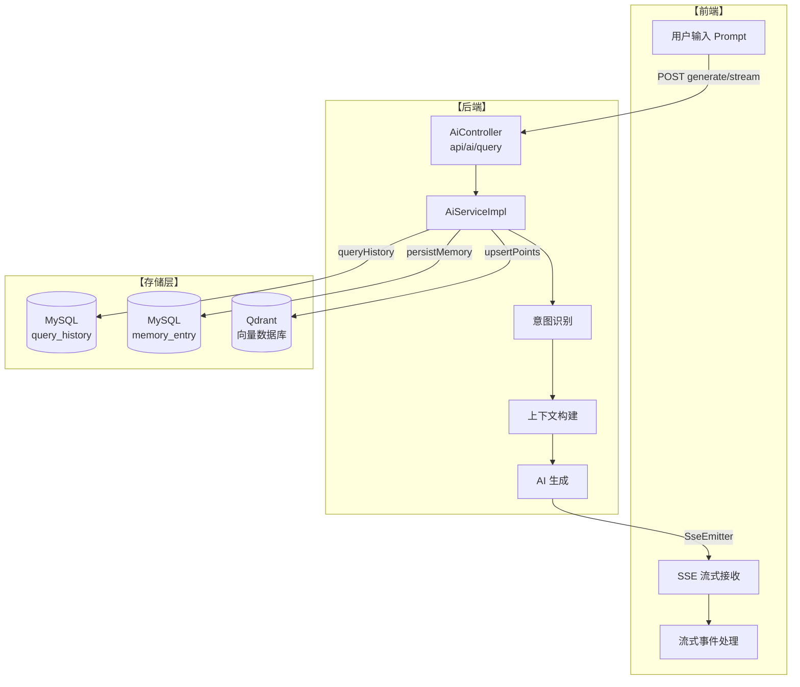
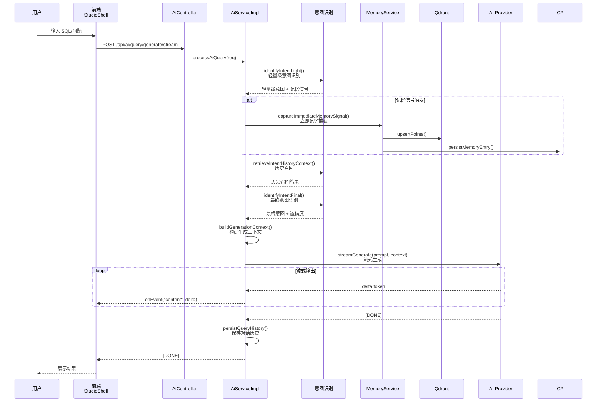
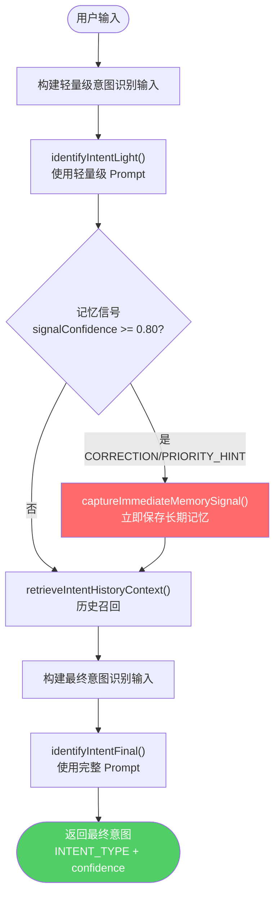
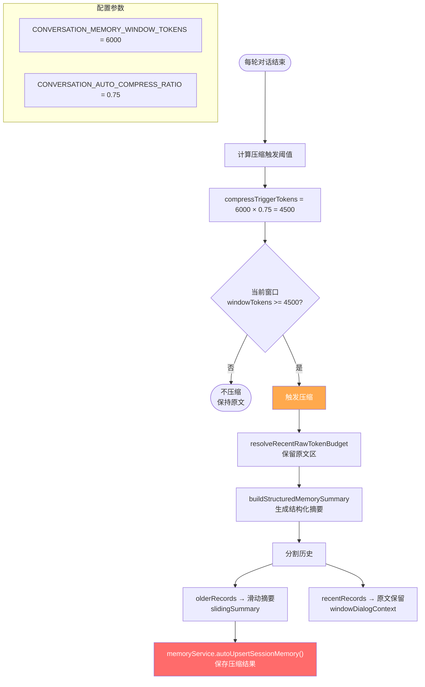
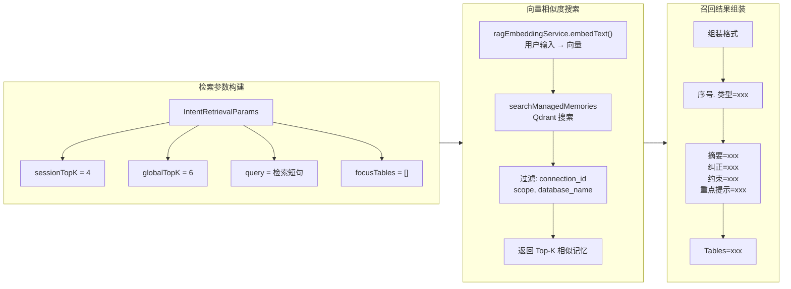
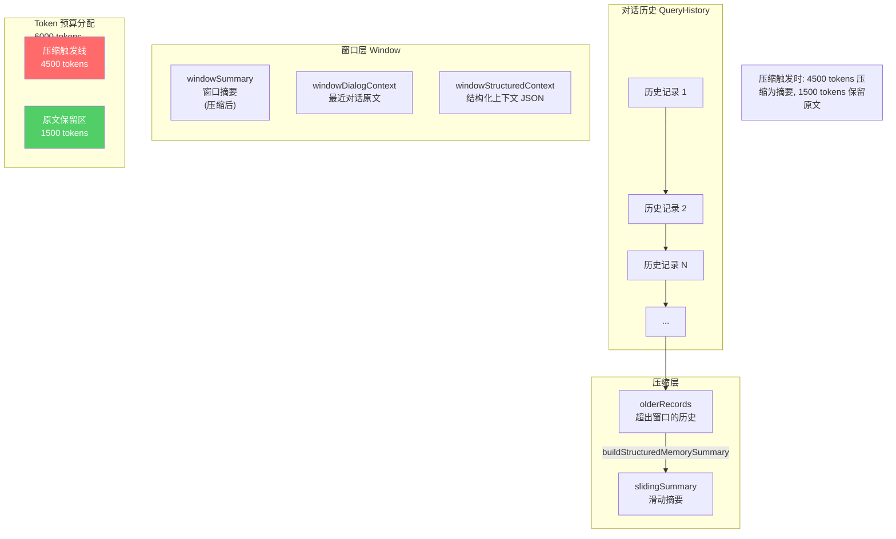
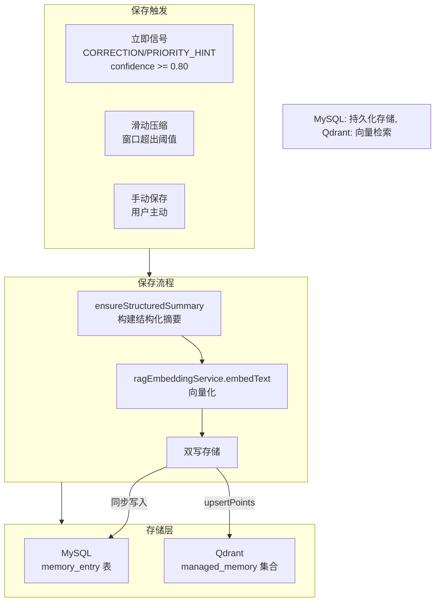
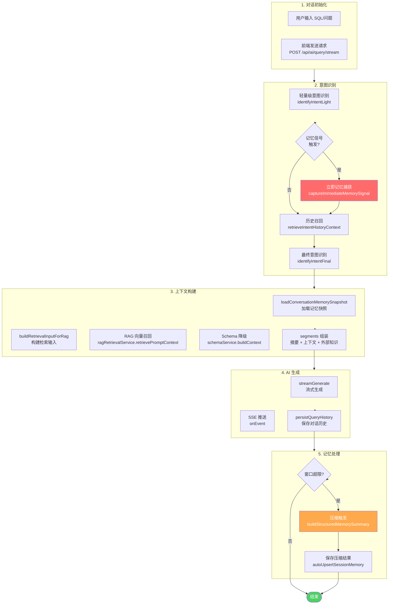

# AI 对话实现流程

## 一、系统架构总览

## 二、对话完整时序图

## 三、意图识别流程

## 四、记忆压缩触发机制

## 五、记忆召回流程

## 六、上下文窗口分层模型

## 七、记忆保存双写机制

## 八、完整对话流程图

## 九、关键配置参数表

| 参数名 | 默认值 | 说明 |
|--------|--------|------|
| `CONVERSATION_MEMORY_WINDOW_SIZE` | 12 | 会话窗口大小（条记录） |
| `CONVERSATION_MEMORY_WINDOW_TOKENS` | 6000 | 会话窗口 Token 预算 |
| `CONVERSATION_AUTO_COMPRESS_RATIO` | 0.75 | 自动压缩触发比例 |
| `MEMORY_SIGNAL_TRIGGER_CONFIDENCE` | 0.80 | 记忆信号触发置信度阈值 |
| `SESSION_HISTORY_RECALL_LIMIT` | 8 | 会话历史召回上限 |
| `GLOBAL_HISTORY_RECALL_LIMIT` | 10 | 全局历史召回上限 |
| `AUTO_INTENT_MIN_CONFIDENCE` | 0.70 | 意图识别最低置信度 |

## 十、核心类对应关系

| 功能 | 核心类 | 路径 |
|------|--------|------|
| 对话入口 | `AiController` | `apps/server/src/.../controller/AiController.java` |
| 对话服务 | `AiServiceImpl` | `apps/server/src/.../service/impl/AiServiceImpl.java` |
| 上下文管理 | `AiConversationContextManager` | `apps/server/src/.../service/impl/AiConversationContextManager.java` |
| 记忆服务 | `MemoryService` | `apps/server/src/.../service/MemoryService.java` |
| 记忆存储 | `MemoryEntryMapper` | `apps/server/src/.../mapper/MemoryEntryMapper.java` |
| 历史存储 | `QueryHistoryMapper` | `apps/server/src/.../mapper/QueryHistoryMapper.java` |
| 向量存储 | `QdrantClientService` | `apps/server/src/.../service/QdrantClientService.java` |
| 前端对话 | `useStudioRuntime.ts` | `apps/desktop/src/modules/studio/composables/useStudioRuntime.ts` |
| 前端记忆 | `useMemoryModule.ts` | `apps/desktop/src/modules/studio/composables/useMemoryModule.ts` |
