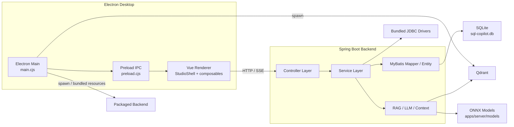
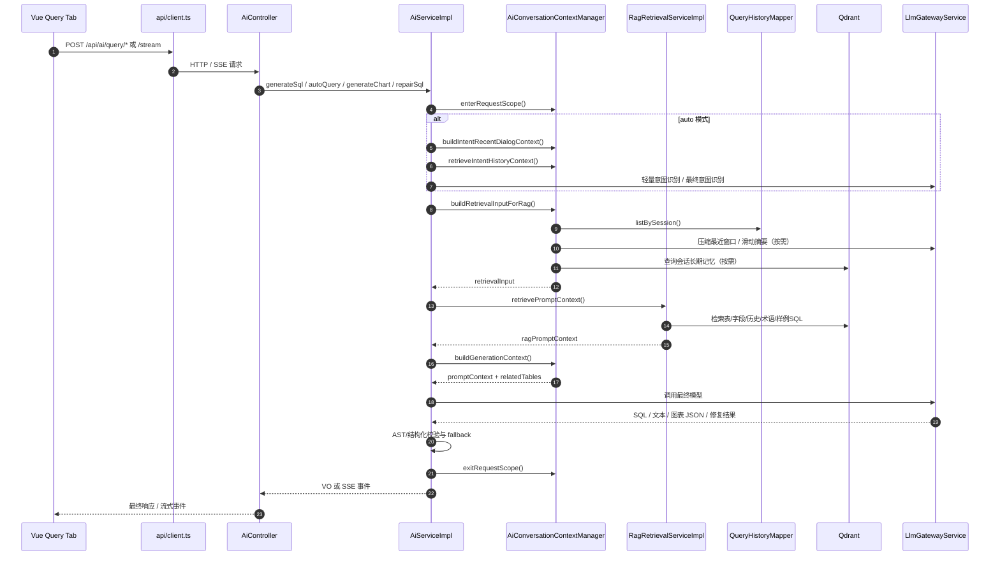
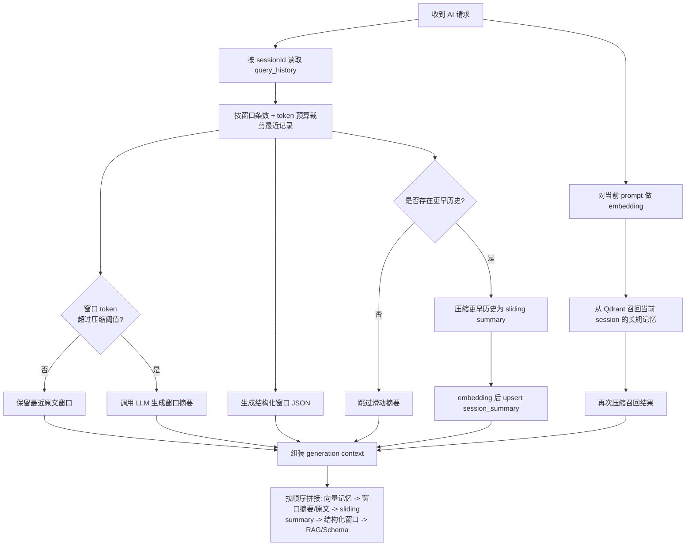
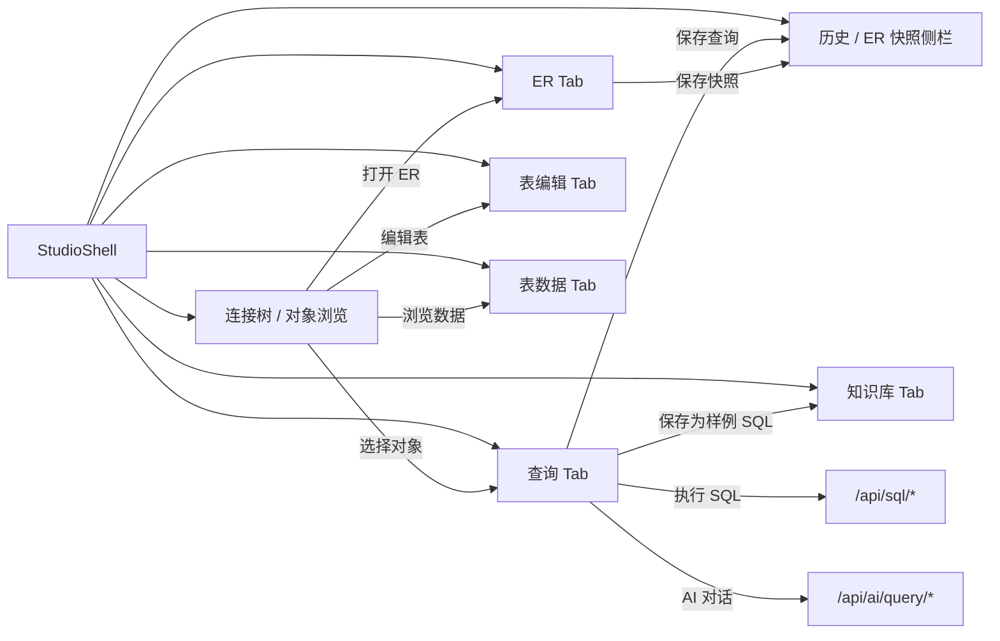
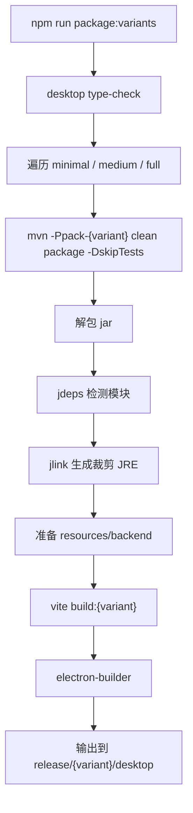

# SQL Copilot 技术架构文档

## 1. 文档范围

本文只描述当前仓库中已经落地的实现，不引用 PRD 中尚未完成的设想。内容主要依据以下代码与配置整理：

- 前端入口与桌面壳：`apps/desktop/src/main.ts`、`apps/desktop/src/App.vue`、`apps/desktop/electron/main.cjs`
- 主工作台：`apps/desktop/src/modules/studio/components/StudioShell.vue`
- 前端编排：`apps/desktop/src/modules/studio/composables/useStudioController.ts`、`useStudioRuntime.ts`
- 后端入口：`apps/server/src/main/java/com/sqlcopilot/studio/SqlCopilotApplication.java`
- 后端核心链路：`AiController.java`、`AiServiceImpl.java`、`AiConversationContextManager.java`、`RagRetrievalServiceImpl.java`
- 本地持久化与配置：`apps/server/src/main/resources/schema.sql`、`application.yml`、`application-minimal.yml`、`application-medium.yml`、`application-full.yml`
- 打包脚本：`scripts/package-variants.mjs`

## 2. 总体架构

### 2.1 分层说明

- Electron 主进程负责窗口、IPC、本地图表缓存，以及在打包态拉起 Qdrant 和 backend 资源。
- Vue 渲染层只通过 `fetch` 访问 `http://localhost:18080`，不直接操作数据库或模型。
- Spring Boot 后端承担数据库连接、Schema 读取、SQL 执行、AI 调用、RAG 检索、知识库和本地 SQLite 持久化。
- Qdrant 承担向量检索；SQLite 负责连接配置、历史、知识、AI/RAG 配置、快照等元数据。

## 3. 模块划分

### 3.1 桌面端模块

#### Electron 主进程

- 文件：`apps/desktop/electron/main.cjs`
- 职责：
  - 创建窗口、设置最小尺寸、加载开发态或打包态页面
  - 注册 IPC：文件选择、目录选择、图表缓存保存/读取
  - 解析 Qdrant 路径并在打包态启动内置 Qdrant
  - 管理 backend/Qdrant 子进程生命周期

#### 渲染层入口

- `main.ts`：初始化 Vue、Ant Design Vue、Monaco worker
- `App.vue`：只挂载 `StudioShell`
- `useStudioController.ts`：将 `useStudioRuntime` 与多个业务模块组合成统一控制器

#### 主工作台模块划分

前端实际采用“运行时状态 + 多个业务 composable”的拆分方式：

| 模块 | 主要文件 | 职责 |
| --- | --- | --- |
| 运行时总线 | `useStudioRuntime.ts` | 全局状态、API 调用、Tab 管理、Monaco、流式 AI、SQL 执行 |
| 连接/对象浏览 | `useConnectionBrowserModule.ts` | 连接树、对象右键菜单、表操作入口 |
| AI 查询 | `useQueryModule.ts` | 输入区行为、取消执行、消息重试、SQL 回填 |
| ER 图 | `useErModule.ts` | ER Tab、关系路由、AI 关系删改 |
| ER 快照 | `useErSnapshotModule.ts` | 快照分页、打开、改名、删除、保存 |
| 历史会话 | `useHistoryModule.ts` | 历史分页、恢复为会话 Tab、删除、标题覆写 |
| 知识库 | `useKnowledgeModule.ts` | 术语、样例 SQL、向量重建、从查询保存样例 |
| 表结构编辑 | `useTableEditorModule.ts` | 新建/修改表、DDL 执行、刷新 Schema |
| 表数据浏览 | `useTableDataModule.ts` | 分页、筛选、排序、行编辑、提交事务 |
| UI 壳层 | `useUiShellModule.ts` | 主题、窗口尺寸、三栏拖拽宽度 |

### 3.2 后端模块

#### 接口层

| 控制器 | 路径前缀 | 实际能力 |
| --- | --- | --- |
| `ConnectionController` | `/api/connection` | 连接管理、测试、库列表预览 |
| `SchemaController` | `/api/schema` | Schema 同步、概览、表详情、ER 图、DDL、缓存刷新 |
| `SqlController` | `/api/sql` | 执行、EXPLAIN、风险评估 |
| `AiController` | `/api/ai/query` | 生成、自动模式、解释、分析、图表、修复，含 SSE |
| `EditorController` | `/api/editor` | 历史、保存查询、ER 快照、图表缓存、结果导出 |
| `KnowledgeController` | `/api/knowledge` | 术语、样例 SQL、知识向量重建 |
| `RagConfigController` | `/api/rag/config` | RAG 配置读取/保存 |
| `RagVectorizeController` | `/api/rag/vectorize` | 全库入队、单表向量化、中断、状态、概览 |
| `AiConfigController` | `/api/ai/config` | 模型与会话记忆配置 |
| `HealthController` | `/api/health` | 健康检查 |

#### 服务层

| 服务 | 主要实现 | 说明 |
| --- | --- | --- |
| `ConnectionServiceImpl` | JDBC 建连、预览数据库、连接测试 | 配合 SSH 隧道与驱动解析 |
| `SchemaServiceImpl` | Schema 缓存、表详情、表统计、DDL | 结合调度刷新 |
| `SqlServiceImpl` | 风险评估、执行、Explain | 执行前做只读/风险拦截 |
| `EditorServiceImpl` | 历史、快照、保存查询、导出 | 基于 SQLite 持久化 |
| `KnowledgeServiceImpl` | 术语、样例 SQL、重建向量 | 同时写本地表与向量库 |
| `ErDiagramServiceImpl` | ER 图构建 | 融合表结构和 AI 关系 |
| `AiServiceImpl` | AI 主流程编排 | 意图识别、RAG、生成、校验、流式输出 |
| `AiConversationContextManager` | 会话上下文管理 | 压缩、窗口、结构化上下文、长期记忆 |
| `RagVectorizeQueueServiceImpl` | 向量化任务队列 | 数据库级状态与单表向量化 |
| `RagRetrievalServiceImpl` | 多桶检索与 rerank | 表、字段、历史、术语、样例 SQL |

#### 持久化层

`schema.sql` 当前实际维护了这些本地表：

- `connection_info`
- `query_history`
- `er_graph_snapshot`
- `audit_log`
- `ai_provider_config`
- `rag_embedding_config`
- `rag_vectorize_status`
- `saved_query`
- `knowledge_term`
- `knowledge_example_sql`

这些表覆盖连接配置、对话历史、ER 快照、AI/RAG 配置、向量化状态、知识库等本地元数据。

## 4. 关键技术点

### 4.1 工作台编排方式

- `StudioShell.vue` 是唯一主界面容器，但业务逻辑没有继续堆在模板内。
- `useStudioController()` 以 `useStudioRuntime()` 为核心，按功能拼接多个 composable。
- `useStudioRuntime.ts` 负责：
  - 所有 Tab 状态
  - API 请求与 SSE 解析
  - SQL 编辑器上下文注册
  - 历史回填、图表缓存、向量状态轮询
  - 与各模块共享的公共工具

这种方式让 UI 还是单工作台，但状态和行为已经分拆成可维护模块。

### 4.2 Electron 与本地资源集成

- preload 只暴露最小 IPC 面：`pickFile`、`pickDirectory`、`saveChartCache`、`readChartCache`
- 图表缓存保存在 Electron `userData/chart-cache`
- 打包态通过 `extraResources` 注入：
  - `resources/qdrant`
  - `resources/backend`
- 这意味着桌面包不是只带前端静态资源，而是带可启动的本地后端和向量库资源

### 4.3 AI 对话链路

AI 主流程集中在 `AiServiceImpl`：

1. 可选执行轻量意图识别
2. 构造检索输入
3. 调用 `RagRetrievalServiceImpl.retrievePromptContext`
4. 调用 `AiConversationContextManager.buildGenerationContext`
5. 调用 `LlmGatewayService`
6. 对生成结果做 AST/结构化校验
7. 以普通 JSON 或 SSE 流形式返回前端

其中 `auto`、`generate`、`generate-chart`、`explain`、`analyze`、`repair` 都已落地，不是占位接口。

### 4.4 上下文压缩与会话记忆

`AiConversationContextManager` 当前实现了完整的请求级上下文治理：

- 记忆开关：优先请求级，其次 AI 全局配置
- 请求内缓存：`ThreadLocal` request scope，避免同一请求重复压缩/重复召回
- 记忆窗口：
  - 默认窗口条数 `12`
  - 最小 `4`
  - 最大 `50`
- token 预算：
  - 默认窗口 token `6000`
  - 最小 `512`
  - 最大 `32000`
- 自动压缩阈值：
  - 默认比例 `0.75`
- 产出内容：
  - 最近原文窗口
  - 窗口摘要
  - 滑动摘要
  - 结构化 JSON 上下文
  - 向量召回的长期记忆
- 长期记忆：
  - 摘要写入 `sql_history` 集合
  - `entry_type=session_summary`
  - 默认 TTL 30 天

### 4.5 RAG 检索结构

`RagRetrievalServiceImpl` 当前并不是单桶检索，而是并行检索多个集合：

- `schema_table`
- `schema_column`
- `sql_history`
- `metric_term`
- `example_sql`
- `sql_fragment`

关键策略：

- 先按命中表形成 table constraints，再过滤字段、历史和术语
- 对多个桶分别 rerank
- 当样例 SQL 命中但关联表未命中时，会回查 Schema 并补齐表/字段命中
- 支持 connection 级和 global 级知识跨作用域召回

### 4.6 SQL 编辑器补全

前端 SQL 编辑能力并不是静态 Monaco 集成，`useStudioRuntime.ts` 还做了：

- 当前连接/数据库上下文注册
- 动态加载对象名
- 表名建议预热
- SQL 关键词建议
- 选区浮层动作
- 知识中心样例 SQL 与查询页共享补全逻辑

### 4.7 变体打包策略

`scripts/package-variants.mjs` 当前流程如下：

1. `mvn -Ppack-{variant} clean package -DskipTests`
2. 解包 Spring Boot Jar
3. `jdeps` 推导模块依赖
4. `jlink` 生成裁剪 JRE
5. 将 backend 运行时目录塞入桌面资源
6. 执行对应的 `vite build` 与 `electron-builder`

当前变体差异：

- `minimal`：后端默认在线 embedding/rerank，前端只暴露在线 RAG 选项
- `medium`：前端允许在线/本地切换，但后端 profile 默认仍是在线 embedding/rerank 配置
- `full`：后端默认本地 ONNX embedding + 本地 rerank，并打包模型目录

## 5. 关键流程

### 5.1 AI 对话处理时序图

下图对应当前 `generate/auto/generate-chart/repair` 共有的核心链路，差别只在意图判断和最终 system prompt。

### 5.2 会话上下文压缩流程图

该流程直接对应 `AiConversationContextManager.buildConversationMemorySnapshot()` 及其后续拼装逻辑。

### 5.3 桌面端工作台交互流程

### 5.4 多变体打包流程

## 6. 现状边界与注意事项

- 前端 API 地址当前写死为 `http://localhost:18080`，未做环境切换层。
- SQLite 数据源默认写的是当前开发机工程路径，开发和打包环境需要注意配置覆盖。
- `full` 变体才会打包 `apps/server/models`；`minimal` 与 `medium` 的默认 profile 并不相同。
- AI 流式和普通接口都已实现，但能力复用集中在 `AiServiceImpl`，后续若继续扩展任务类型，建议保持这条主编排线不再分叉。

## 7. 结论

当前 SQL Copilot 已经形成了完整的桌面端工作台、本地后端、SQLite 元数据、Qdrant 向量检索、AI 对话与多变体打包体系。最核心的架构特点不是单点技术选型，而是三条已经打通的主链路：

- 桌面端工作台多 Tab 交互链路
- AI 对话 + RAG + 上下文压缩链路
- backend + jlink + Electron 的本地交付链路

后续如果继续演进，建议仍然围绕这三条主链路做增量设计，而不是回到“前后端各自堆功能点”的方式。
